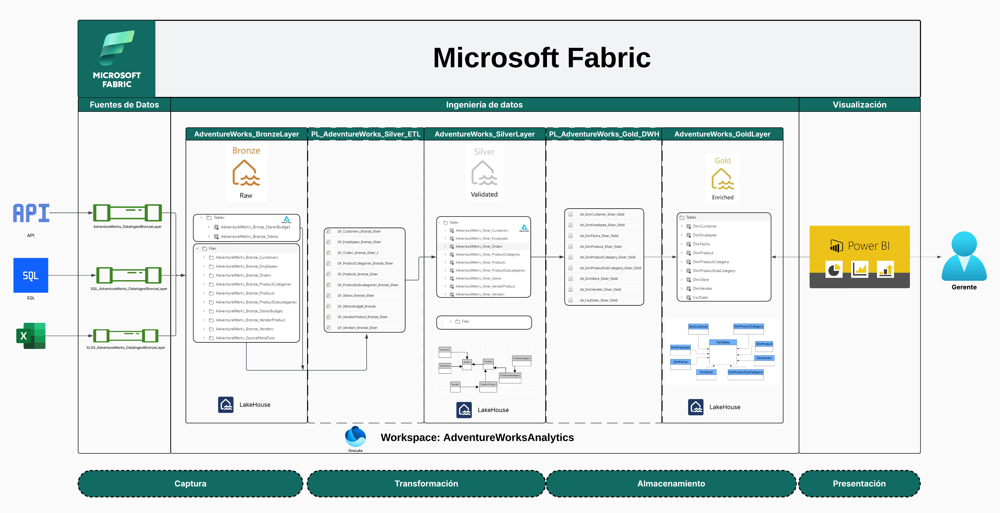
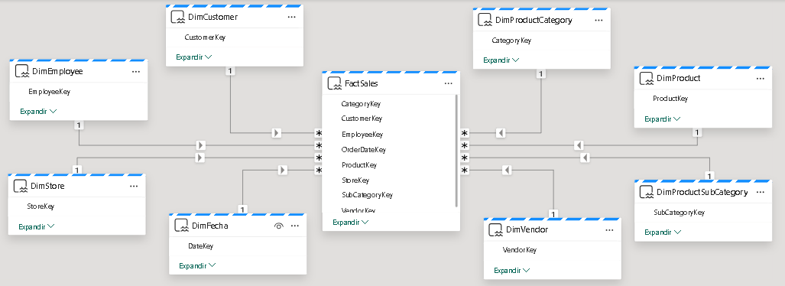
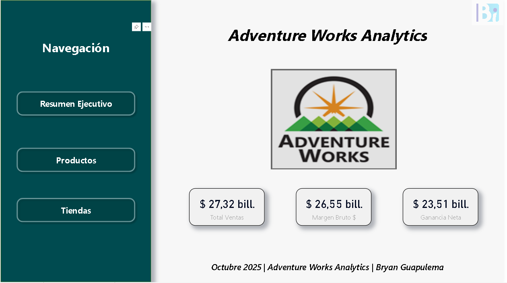
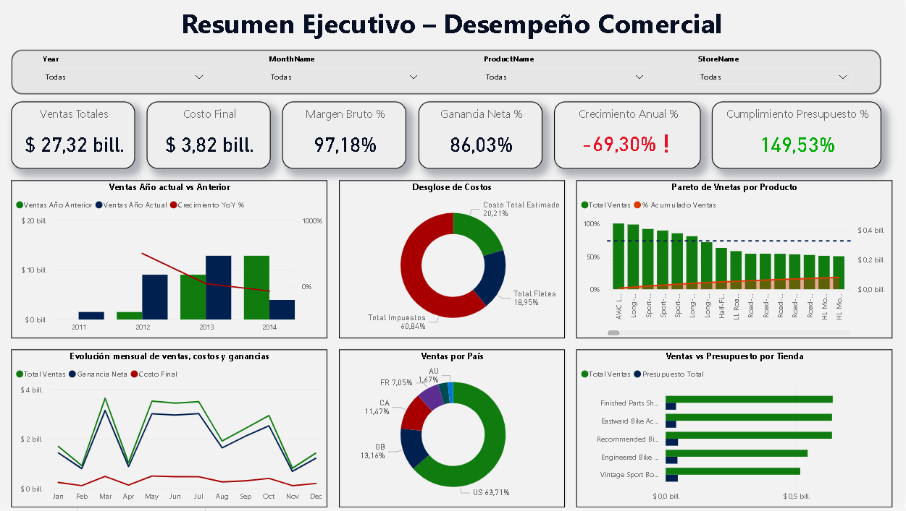
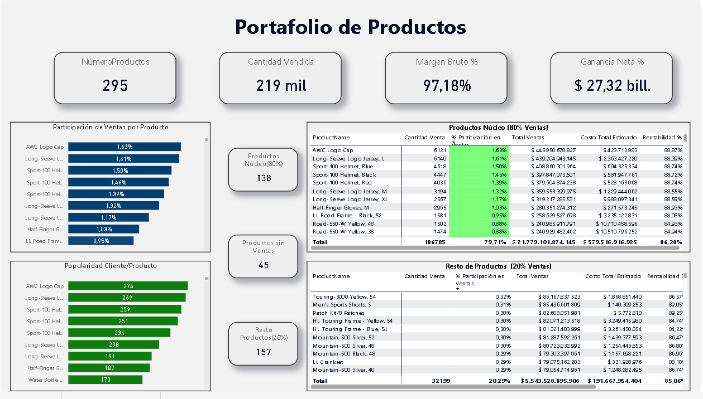
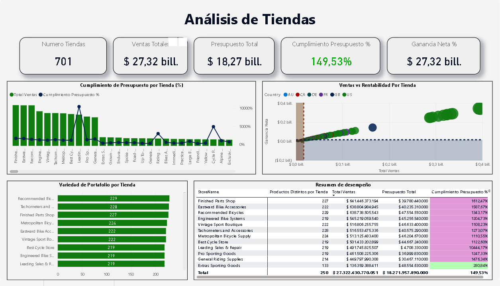

# Adventure Works Analytics – Business Intelligence with Microsoft Fabric

## 📘 Descripción general
Proyecto de Inteligencia de Negocios **`end-to-end`** desarrollado en **`Microsoft Fabric`** ,siguiendo la arquitectura **`Medallion (Bronze–Silver–Gold)`**.  
El objetivo es integrar datos comerciales de *Adventure Works* provenientes de distintas fuentes para generar **insights gerenciales** que aporten a la toma de decisiones estratégicas.

---

## ⚙️ Requisitos técnicos
- **Plataforma:** Microsoft Fabric  
- **Fuentes de datos:**
  - **API**: archivos CSV consumidosdesde GitHub (Customers, Employees, Orders, Products, etc.)  
  - **Base de datos MySQL**: tabla *Stores*
  - **Archivo Excel**: presupuestos por tienda (storesBudget)
- **Transformaciones:** realizadas mediante **Dataflows Gen2** y **Notebooks PySpark**  
- **Carga:** archivos (capa Bronze) y tablas Delta(capas Silver y Gold) en Lakehouse dentro de **`OneLake`**. 
- **Visualización:** dashboards gerenciales en Power BI integrados en Fabric  

---

## 🏢 Resumen de la empresa – Adventure Works

**Adventure Works Cycles** es una compañía **`manufacturera y distribuidora`** de bicicletas de alto rendimiento, accesorios y componentes.  
La empresa opera a nivel internacional, con presencia en **América del Norte, Europa y Asia**, gestionando un modelo de negocio mixto que combina **ventas al por mayor** y **distribución minorista a través de tiendas asociadas**.

### 🌍 Contexto operativo
Adventure Works cuenta con una amplia red de **tiendas físicas y distribuidores**, además de un canal de ventas en línea.  
Su estructura organizativa incluye:
- Un equipo comercial dividido por **territorios** (país, región y ciudad).  
- Un catálogo de productos organizado jerárquicamente en **categorías y subcategorías**.  
- Relaciones estratégicas con **proveedores (vendors)** responsables del suministro de componentes y materias primas.  

### 💼 Objetivo comercial
El principal objetivo de Adventure Works es **optimizar sus procesos de ventas y distribución**, incrementando la rentabilidad y fortaleciendo la relación con clientes y proveedores.  
Para lograrlo, la compañía busca aprovechar la **analítica de datos** para:
- Medir el desempeño de tiendas y empleados.  
- Analizar la rentabilidad de productos y líneas de negocio.  
- Evaluar el cumplimiento de presupuestos y metas comerciales.  

---
## 🧱 Arquitectura del proyecto

## 🛢️ Modelo de datos:

---

## 🧠 Herramientas y tecnologías
- **Microsoft Fabric:** Lakehouse, Data Factory, Dataflows Gen2, Notebooks, Power BI  
- **Lenguajes:** PySpark, SQL, DAX  
- **Fuentes externas:** GitHub (CSV), MySQL, Excel  

---

## 📊 Dashboards gerenciales

- Dashboard #1: Menú/Inicio

- Dashboard #2: Resumen Ejecutivo

- Dashboard #3: Detalle Producto

- Dashboard #4: Detalle Tienda

---
## 🏁 Resultados

- Enlace de acceso al informe

<a href='https://app.fabric.microsoft.com/groups/4ed7945f-ed35-4eb6-9deb-814d2fe747e0/reports/f9794bec-3b14-4099-8f5c-dff26d2b3095?ctid=3d285e75-2402-401a-aa82-b00278f48a41&pbi_source=linkShare'>
https://app.fabric.microsoft.com/groups/4ed7945f-ed35-4eb6-9deb-814d2fe747e0/reports/f9794bec-3b14-4099-8f5c-dff26d2b3095?ctid=3d285e75-2402-401a-aa82-b00278f48a41&pbi_source=linkShare
</a>

- QR de acceso al informe

- Historia resultante (Analisis):

Este proyecto contempla el análisis de Adventure Works, una empresa manufacturera y distribuidora de productos y accesorios de bicicletas, durante el periodo de mayo del 2011 a mayo del 2014.
Primero una visión general de la empresa, en donde se nota que en el periodo de 3 años se ha obtenido una venta de 27 billones de dólares con un costo reducido de 3,82 billones demostrando alta rentabilidad que se refleja en un margen y ganancia elevado. Ahora bien, lo que salta a la vista en primer lugar es el decrecimiento de ventas en el último año (2014) respecto a años anteriores en donde el crecimiento fue positivo. Así pues se nota los meses con un menor volumen de ventas se concentran en los meses de febrero, abril y noviembre.  Pero esto también nos muestra que los costos son muy bajos respecto a las ventas y ganancias de modo que no solo se recupera la inversión sino que se gana muchísimo. 

Pero como están distribuidos los costos. Se nota que el costo esta constituido por 3 tipos de costos: los de producción, transporte e impuestos, siendo este último el que representa un mayor peso en los costos. Para ello se debe notar que el 60% las ventas se concentran en Estados Unidos por lo que los impuestos y costos de transporte pueden ser reducidos al centrarse en este país. 

Pero como están distribuidas las ventas. Para ello se nota que empresas americanas son aquellas con el mayor volumen de ventas aunque también salta a relucir que a pesar de que la meta de ventas para estos 3 años se cumplió, existe una pésima distribución de presupuestos para cada tienda con casos en los que se sobre cumple el presupuesto en mas de 500% y casos en los que no supera el 1%, denotando la necesidad de reestructurar la planificación de metas de venta para cada tienda.

Así pues, se nota que la empresa conta con 295 productos vendidos un total del 219 mil veces. Así pues, primero se nota la tendencia de que aquellos productos con mayor participación en ventas son aquellos con mayor rentabilidad y son estos mismos productos aquellos preferidos por el cliente. Pero retomando el Pareto se observa que 138 productos constituyen el 80% de las ventas con 186 mil de 219 mil productos vendidos y 21 billones de los 27 billones totales en ventas; mientras que los 157 productos restantes aportan tan solo con el 20% de los que 45 (el 30%) no se han vendido durante los 3 años en análisis. Aquí lo restaría hacer es quitar los 45 productos del catálogo, decidir si los productos con una baja contribución valen la pena continuar o en todo caso deducir los costos de pestos productos en el top de productos mas rentables o en los productos del ultimo tramo de productos núcleo a fin de mejorar las ventas.

Finalmente vamos con las tiendas que en realidad son los clientes principales de Adventure Works pues recordemos que es una distribuidora. Así pues se nota que se vendieron a 701 tiendas con una meta de venta de 18,27 millones con un cumplimiento de 157% sin embargo se nota que el cumplimiento presupuestario es dispar a lo largo de los casos, con tiendas con un cumplimiento excesivo que supera los 500% y otras con un cumplimiento extremadamente pobre con menos de 1%. Así pues, una recomendación de cajón es restructurar la planificación presupuestaria por tienda, teniendo en consideración que las tiendas a las que se vendieron más variedad de productos son aquellas que generan más ventas por lo que se debe establecer metas basadas en las ventas y catálogo de productos por cada una de las tiendas. además de que se nota que la mayor rentabilidad es correspondida en el volumen de ventas y esta se concentra en estados unidos, siendo la recomendación de concentrarse en estados unidos como mercado principal.

---

## Recursos

<ul>
  <li>
    <a href='https://github.com/BryanGuapulema/AW_data_csv'>
      Fuentes de datos CSV y Excel
    </a>
  </l1>
  <li>
    <a href='https://github.com/BryanGuapulema/Notebooks_Silver_Gold_DWH'>
      Notebooks de carga DWH
    </a>
  </l1>
</ul>

---
## 👨‍💻 Autor
**Bryan Guapulema - 2025**  
---